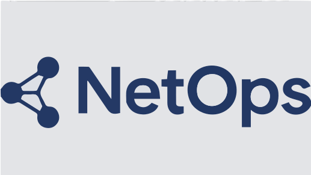

# Network Design App | Network Engineer One-Stop Integrated Service Platform

<p align="center">
  
</p>

<p align="center">
  <strong>A comprehensive network operations platform designed for network engineers, integrating AI-powered network generation, device management, troubleshooting, packet analysis, and more.</strong>
</p>

<p align="center">
  <a href="./README.zh-CN.md">🇨🇳 中文文档</a> | <a href="./README.en.md">🇺🇸 English Documentation</a>
</p>

---

## 📖 Project Overview

This project is a one-stop integrated service platform for network engineers, featuring:

- 🧠 **AI-Powered Network Generator**: Automatically generate network diagrams and configurations.
- 🔧 **Device Management Center**: A centralized place to manage network devices.
- 🤖 **NetGPT - AI Troubleshooting Assistant**: An AI-powered assistant to help troubleshoot network issues.
- 📊 **Packet Capture & Analysis**: A tool for capturing and analyzing network packets.
- 💬 **AI Intelligent Chat**: An integrated chat interface for interacting with the AI.
- 🔌 **Real-time WebSocket Communication**: Uses Socket.IO for real-time communication between the client and server.

## 🚀 Quick Start

### Prerequisites

- Node.js (v18 or newer)
- npm / pnpm / yarn
- Python (for packet analysis scripts)

### Installation and Running

1.  **Install dependencies:**
    ```bash
    npm install
    ```

2.  **Configure the database:**
    - The project uses Prisma and a SQLite database.
    - To initialize the database, run:
    ```bash
    npx prisma db push
    ```

3.  **Start the development server:**
    ```bash
    npm run dev
    ```
    The web application will be available at `http://localhost:3005`.

4.  **Run the desktop application (development mode):**
    ```bash
    npm run desktop:dev
    ```

---

## 📚 Documentation

For more detailed information, please refer to the documentation in your preferred language:

- [**English Documentation**](./README.en.md)
- [**中文文档 (Chinese Documentation)**](./README.zh-CN.md)

## 🤝 Contributing

Contributions are welcome! Please feel free to submit a pull request or open an issue.

## 📄 License

This project is licensed under the MIT License.